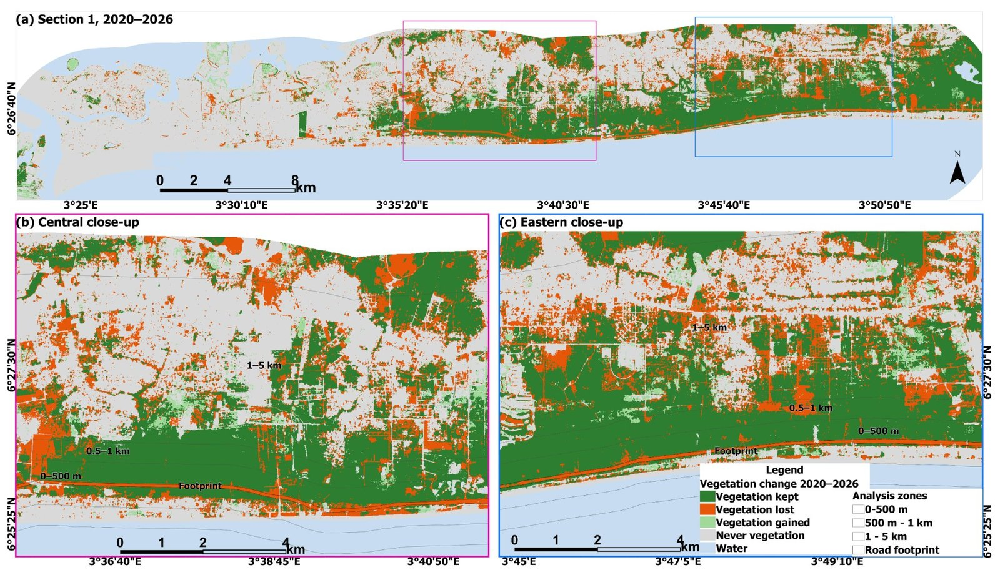

# Vegetation Loss along Section 1 of the Lagos–Calabar Coastal Highway, Nigeria

**Code, data and results for:** *Remote Sensing Assessment of Vegetation Loss Following Construction of Phase 1 of the Lagos–Calabar Coastal Highway, Nigeria* (Ayomide, manuscript in preparation).

This repository measures how much coastal vegetation was lost along the first 47.5 km of the Lagos–Calabar Coastal Highway, and how much of that loss **the road itself caused**, as distinct from the urbanisation that was already transforming the Lekki corridor. It combines seven years of Sentinel-2 and Sentinel-1 imagery (2020–2026), a Random Forest land-cover classification, a design-based accuracy assessment, and a matched event-study **difference-in-differences** comparison with 110 kilometres of untouched control coastline.


*Vegetation change in Section 1 between the 2020 and 2026 dry seasons. Orange = vegetation lost; the continuous orange strip along the coast is the construction footprint.*

---

## Contents
- [Repository structure](#repository-structure)
- [Quick start](#quick-start-reproduce-every-number-in-2-minutes)
- [Guided notebooks](#guided-notebooks)
- [Full reproduction from satellite imagery](#full-reproduction-from-satellite-imagery-google-earth-engine)
- [Scripts in run order](#scripts-in-run-order)
- [Data dictionary](#data-dictionary)
- [Key methodological decisions](#key-methodological-decisions)
- [Limitations](#limitations)
- [Citation, licence and acknowledgements](#citation-licence-and-acknowledgements)

---

## Repository structure

```
lagos-calabar-s1-vegetation-loss/
├── README.md                 ← this file
├── LICENSE                   ← MIT
├── CITATION.cff
├── requirements.txt          ← Python packages
├── gee/                      ← Google Earth Engine scripts (JavaScript, Code Editor)
│   ├── 01_composites.js … 09_change_map_download.js
│   └── archive/00_original_full_workflow_reference.js   (first design, superseded; kept for transparency)
├── notebooks/                ← six guided Jupyter notebooks: explanation + code + results, step by step
├── python/                   ← analysis scripts, run in numbered order (or python/run_all.py)
│   ├── paths.py              ← folder locations shared by every script
│   └── 01_… 10_…py, run_all.py
├── data/                     ← inputs (all small enough for GitHub; 8 MB)
│   ├── vectors/              ← centreline, footprint, units, control lines, exclusion zone, AOI
│   ├── rasters/              ← 21 land-cover maps (7 years × Section 1 / West / East) + change map
│   ├── tables/               ← Earth Engine panel table, covariates, stratum areas, screening, imagery log
│   ├── training/             ← 310 training polygons (GeoJSON)
│   └── validation/           ← 300 accuracy points, blind labels and answer key
├── results/                  ← everything produced by python/ (re-created by run_all.py)
└── docs/figures/             ← images used in this README
```

---

## Quick start: reproduce every number in 2 minutes

The Earth Engine outputs are already in `data/`, so the whole statistical analysis runs locally.

```bash
git clone https://github.com/Hexcel-Nathan/Vegetation-Loss-along-Section-1-of-the-Lagos-Calabar-Coastal-Highway-Nigeria.git
cd Vegetation-Loss-along-Section-1-of-the-Lagos-Calabar-Coastal-Highway-Nigeria

# with conda (recommended on Windows, because of GDAL/rasterio)
conda create -n lagcal -c conda-forge python=3.11 geopandas rasterio libpysal esda statsmodels openpyxl matplotlib pyshp
conda activate lagcal

# or with pip
pip install -r requirements.txt

python python/run_all.py
```

Expected console output ends with `All steps finished. Outputs are in results/.` Main outputs:

| File in `results/` | What it is | Paper |
|---|---|---|
| `Vegetation_loss_results.xlsx` | Everything in one workbook: live-formula summary, accuracy, matching, DiD, event study, fragmentation, hotspots | Tables 2–5, S2–S4 |
| `accuracy_summary.csv`, `accuracy_error_matrices.csv` | Olofsson accuracies and error-adjusted areas | Table 2, Table S2 |
| `matching_balance.csv`, `matched_pairs.csv` | Covariate balance (SMD) and the matched pairs | Table 4 |
| `did_results.csv`, `event_study.csv` | Pooled DiD (3 specifications) and event-study coefficients | Table 5, Fig. 7 |
| `fragmentation_summary.csv`, `fragmentation_did.csv` | Patch metrics and their DiD | Section 4.4, Table S4 |
| `hotspot_summary.csv`, `vectors/hotspots_S1_5ha.shp` | Gi* hotspot statistics and the map layer | Fig. 8, Table S3 |
| `vectors/segment_zones_all.shp` | All 628 analysis units | Fig. 1 |
| `Figure2_workflow.png`, `Figure6_loss_trajectories.png`, `Figure7_event_study.png` | Publication figures made in Python (300 dpi) | Figs 2, 6, 7 |

---

## Guided notebooks

The `notebooks/` folder tells the same analysis as a story: every step is explained in plain language (with the equations where they matter), followed by the code and its results: tables, maps and charts. GitHub shows the notebooks **with their outputs**, so you can read them without running anything. They produce exactly the same numbers as the scripts (checked).

| Notebook | Question | What you will see |
|---|---|---|
| [`00_overview_and_data`](notebooks/00_overview_and_data.ipynb) | What data do we have? | Folder contents, the panel table, the outcome variable, land-cover maps for 2020 / 2024 / 2026 |
| [`01_analysis_units_and_covariates`](notebooks/01_analysis_units_and_covariates.ipynb) | How were treated and control units built? | Control segments and Voronoi-split zones, map of all 628 units, baseline covariates, how different the groups were in 2020 |
| [`02_accuracy_assessment`](notebooks/02_accuracy_assessment.ipynb) | How accurate are the maps? | Blind-label matching, the Olofsson estimators, error matrices, mapped vs error-adjusted areas, commission error by group |
| [`03_matching_and_difference_in_differences`](notebooks/03_matching_and_difference_in_differences.ipynb) | How much loss did the highway cause? | Matching and balance plot, the three DiD specifications, wild bootstrap, event study, loss trajectories |
| [`04_vegetation_fragmentation`](notebooks/04_vegetation_fragmentation.ipynb) | Did the road break up the vegetation? | Patch metrics explained, a worked example (segment T33 before/after), metric trajectories, DiD on each metric |
| [`05_hotspots_of_loss`](notebooks/05_hotspots_of_loss.ipynb) | Where was loss concentrated? | Persistent loss, hexagon grid, Gi* with FDR, before/during maps, distance-to-road distribution, sensitivity analysis |

Run them in order (01 → 05), because later notebooks use files written by earlier ones:

```bash
pip install jupyter          # once
jupyter lab notebooks/       # or: jupyter notebook
```

---

## Full reproduction from satellite imagery (Google Earth Engine)

1. **Get Earth Engine access** at <https://earthengine.google.com> and create a Cloud project. In every script in `gee/`, change the first line `var ASSET = 'projects/lekkiproject/assets/';` to your own project.
2. **Upload these assets** (Assets → NEW → Shapefile / GeoJSON), using the names shown:

   | Asset name | Upload from |
   |---|---|
   | `segment_zones_all` | `data/vectors/segment_zones_all.shp` |
   | `study_aoi` | `data/vectors/study_aoi.shp` |
   | `beach_zone_2020` | `data/vectors/beach_zone_2020.shp` |
   | `training_points` | `data/training/training_polygons.geojson` (polygons, fields `class`, `year`) |

3. **Run the scripts in order** in the Code Editor. Scripts that export (`Export.…toAsset`) create tasks: open the **Tasks** tab and click **RUN**, and wait for each to finish before the next script.

   | # | Script | Does | Creates |
   |---|---|---|---|
   | 01 | `01_composites.js` | Median dry-season Sentinel-2 SR composites DS2020–DS2026, Cloud Score+ `cs_cdf` ≥ 0.60, bands B2 B3 B4 B8 B11 + NDVI (×10 000, Int16) + clear-observation count | assets `Composite_DS2020` … `Composite_DS2026` |
   | 02 | `02_check_composites.js` | Displays the composites and clear-observation maps; training polygons were drawn here and saved as `training_points` | – |
   | 03 | `03_classify.js` | Feature stack (S2 bands, NDVI, NDWI, MNDWI, NDBI, Sentinel-1 VV, VH, VV−VH, SRTM elevation, slope); up to 150 samples per class per year; quick 70/30 check; final Random Forest (300 trees) on all polygons; beach = sand inside the 2020 beach zone; temporal rule built → vegetation in one year is reset to built | assets `quick_check`, `LC_DS2020` … `LC_DS2026` |
   | 04 | `04_panel_table.js` | Area of every class, DS2020 vegetation, lost vegetation and elevation × area for each unit and year | asset `panel_table` |
   | 05 | `05_download_panel_csv.js` | Download link for the panel table | `segment_zone_panel_DS2020_2026.csv` → `data/tables/` |
   | 06 | `06_accuracy_points.js` | 300 stratified random points on the change map (80 / 100 / 50 / 70), stratum areas, blind point file and answer key | → `data/validation/` |
   | 07 | `07_truecolour_figures.js` | True-colour DS2026 download for the maps | – |
   | 08 | `08_download_all_outputs.js` | Downloads all true-colour images, all 21 land-cover maps and the training polygons | → `data/rasters/`, `data/training/` |
   | 09 | `09_change_map_download.js` | Vegetation change map DS2020 → DS2026 (1 kept, 2 lost, 3 gained, 4 never vegetated, 5 water) | `Change_2020_2026_S1.tif` |

4. **Label the accuracy points blind.** Open `accuracy_points_blind.shp` in ArcGIS Pro over Esri Wayback (2020 release) and Wayback / PlanetScope (2025–26), and record for each point whether it is vegetation (1) or not (0) in 2020 and in 2026 (`accuracy_labels.xlsx`). Do not open the answer key until labelling is finished.
5. Run the Python pipeline as in the Quick start.

> **Why assets, not Google Drive?** Exports to Drive failed ("not enough space") on the linked account, so every intermediate product is saved as an Earth Engine asset and large files are downloaded with `getDownloadURL`, which is limited to about 48 MB per request. That is why the land-cover maps are split into three pieces (West, Section 1, East).

---

## Scripts in run order

### Python (`python/`)

| # | Script | Purpose | Main inputs | Main outputs |
|---|---|---|---|---|
| 01 | `01_build_control_units.py` | Cuts the control centrelines into 1 km segments, adds a 69.4 m pseudo-footprint and the three bands, splits bands between segments with Voronoi cells, merges with the Section 1 units, and checks the result (628 unique valid units; nearest control 8.4 km from the footprint; zero overlap) | `C_linesWest.shp`, `ClinesEast.shp`, `S1_segment_zones.shp`, `S1_footprint_diss.shp` | `results/vectors/segment_zones_all.shp` |
| 02 | `02_segment_covariates.py` | DS2020 baseline covariates per segment (vegetation, built-up, bare shares; water share; elevation; distance to Lagos Island CBD). Verifies against the published covariates (difference ≈ 1e−14) | panel table, segments | `seg_cov.csv` |
| 03 | `03_accuracy_olofsson.py` | Joins blind labels to the answer key **by coordinates**, then Olofsson/Stehman stratified estimators: overall, user's and producer's accuracy with 95% CI and error-adjusted areas for the 2020, 2026 and change maps | labels, key, stratum areas | `accuracy_*.csv` |
| 04 | `04_matching_did.py` | Mahalanobis nearest-neighbour matching (k = 2, caliper 0.5), balance, pooled DiD in three specifications, event study, wild cluster bootstrap | panel table, covariates | `matching_balance.csv`, `matched_pairs.csv`, `did_results.csv`, `event_study.csv`, `seg_cov_w.csv` |
| 05 | `05_fragmentation.py` | Patch metrics (PLAND, PD, MPA, ED, LPI) for DS2020, DS2024, DS2026 by segment landscape; matched fixed-effects DiD on each metric | land-cover rasters, units, weights | `fragmentation_*.csv` |
| 06 | `06_hotspots.py` | Hexagon grid, persistent loss before and during construction, Getis-Ord Gi* with FDR, sensitivity to 2/5/10 ha hexagons and 500/1000 m bands | land-cover rasters, units | `hotspot_summary.csv`, `vectors/hotspots_S1_5ha.shp` |
| 07 | `07_results_workbook.py` | Workbook part 1: Data, Summary (live SUMIFS formulas and charts), Regression | panel table | `Vegetation_loss_results.xlsx` |
| 08 | `08_add_results_sheets.py` | Workbook part 2: Accuracy, Matching, Matched pairs, DiD results, Event study, Fragmentation, Hotspots | outputs of 03–06 | same workbook |
| 09 | `09_figure2_workflow.py` | Figure 2 workflow diagram (`--markup` adds editing notes) | – | `Figure2_workflow.png` |
| 10 | `10_results_charts.py` | Figure 6 (loss trajectories) and Figure 7 (event study) at 300 dpi | panel table, event study | `Figure6_…png`, `Figure7_…png` |
| – | `run_all.py` | Runs 01–10 in order | | |

---
## Data dictionary

### `data/tables/segment_zone_panel_DS2020_2026.csv` (4,396 rows = 628 units × 7 years; areas in m²)

| Column | Meaning |
|---|---|
| `unit_id` | Segment–zone id, e.g. `T12_B1`, `CW05_F` |
| `seg_id` | 1 km segment: `T01–T47` Section 1, `CW01–CW66` western controls, `CE01–CE44` eastern controls |
| `zone` | `F` footprint, `B1` 0–500 m, `B2` 500 m–1 km, `B3` 1–5 km |
| `treated` | 1 = Section 1, 0 = control |
| `side` | `S1`, `W`, `E` |
| `year` | Dry season (2020 = Nov 2019 – Mar 2020) |
| `a_total` | Unit area |
| `a_veg`, `a_sand`, `a_beach`, `a_built`, `a_water` | Area of each class in that year |
| `a_flagged` | Area with < 3 clear observations (0 everywhere) |
| `a_veg2020` | Area vegetated in DS2020 |
| `a_land2020` | Area not water in DS2020 |
| `a_veglost` | Area vegetated in DS2020 and not vegetated in that year |
| `elev_x_area` | SRTM elevation × pixel area (divide the sum by `a_total` for mean elevation) |

### Rasters (`data/rasters/`)

`LC_DS{year}_{side}.tif`: 10 m, EPSG:32631, uint8; 1 vegetation, 2 sand/bare, 3 beach, 4 built-up, 5 water, 0 no data. `side` = `S1` (Section 1 with its bands), `W`, `E`. `Change_2020_2026_S1.tif`: 1 kept, 2 lost, 3 gained, 4 never vegetated, 5 water.

### Vectors (`data/vectors/`)

| File | Content |
|---|---|
| `LagCal_Section_1centreline` | Section 1 centreline (47.49 km) |
| `S1_footprint_diss` | Construction footprint (332 ha) |
| `S1_segments` | 47 × 1 km Section 1 segments, numbered west → east |
| `S1_segment_zones` | 188 Section 1 units |
| `segment_zones_all` | All 628 units (as uploaded to Earth Engine) |
| `C_linesWest`, `ClinesEast` | Control centrelines. **Names are swapped:** `C_linesWest` holds the eastern line and `ClinesEast` the western one (handled in script 01) |
| `S1_nogo10km` | 10 km exclusion zone around Section 1 used in control screening |
| `beach_zone_2020`, `S1_beach2020_diss` | 2020 beach zone used to split beach from bare sand |
| `study_aoi` | Processing area for Earth Engine |

---

## Key methodological decisions

- **Dry-season composites.** November–March minimises cloud and gives comparable vegetation phenology every year.
- **Mangrove is not separated from other vegetation.** A reliable mangrove class needs field data; instead of claiming mangrove loss, the paper reports all vegetation, and the fragmentation analysis is named vegetation fragmentation.
- **The footprint is reported separately.** Loss under the road is certain; the ecologically important question is what happens around it, so the bands are the focus of attribution.
- **Controls were screened by eye in dated imagery**, not chosen from a map: every stretch with a major post-2020 project was rejected, but ordinary settlement growth was kept, because that is the background change the controls must capture.
- **Matching on baseline urbanisation.** Section 1 was already far more built-up in 2020 than the controls. Matching discards the most urbanised western segments, so the estimates describe the less urbanised, eastern part of the corridor.
- **Persistent loss for hotspots** (two consecutive non-vegetated years) reduces the effect of single-year misclassification.
- **Accuracy labels were joined by coordinates**, because the `pt_id` field was corrupted in export (10 → 1.0 …); all 300 coordinates match exactly.
- **Everything stays in EPSG:32631**, so areas and distances are metric.

---

## Limitations

1. Mapped loss is heavily overstated (user's accuracy 25% for the loss class); results rely on differences between groups, and differential error makes them conservative, but absolute mapped loss areas should not be quoted without the error-adjusted figures.
2. The 0–500 m band had a pre-construction trend (event-study coefficients −8.7 to −5.6 pp before 2024), so induced loss beyond the footprint cannot yet be separated from urbanisation; the DS2026 coefficient is +3.8 pp (95% CI −2.0 to 9.7).
3. Only two post-construction dry seasons are available; induced development along new roads usually takes longer to appear.
4. 10 m pixels cannot resolve narrow mangrove fringes or individual trees.
5. Matching retains 22 of 47 Section 1 segments, so the matched estimates apply to the less urbanised part of the corridor.
6. The footprint was digitised from imagery, not from official as-built plans, which are not public.

---

## Citation, licence and acknowledgements

If you use this code or data, please cite the paper (details to be added on publication) and this repository (see `CITATION.cff`; a Zenodo DOI will be added on release).

> Samson J.A. (2026). *Remote sensing assessment of vegetation loss following construction of Phase 1 of the Lagos–Calabar Coastal Highway, Nigeria: code and data* (v1.0.0). GitHub.

**Licence.** Code: MIT (see `LICENSE`). Derived data in `data/` and `results/`: CC BY 4.0 (see `data/LICENSE.md`). Sentinel-1 and Sentinel-2 data: Copernicus (ESA), free and open. Esri World Imagery Wayback: © Esri and its data providers, used for reference labelling only and not redistributed here. PlanetScope imagery © Planet Labs PBC, used for visual reference only and not redistributed.

**Software.** Google Earth Engine (Gorelick et al., 2017); Python with pandas, statsmodels (Seabold & Perktold, 2010), GeoPandas, rasterio, SciPy, PySAL/esda (Rey & Anselin, 2007), openpyxl and matplotlib; ArcGIS Pro for cartography.

**Key references.** Olofsson et al. (2014) *Remote Sensing of Environment* 148, 42–57 · Stehman (2014) *IJRS* 35, 4923–4939 · Getis & Ord (1992) *Geographical Analysis* 24, 189–206 · Benjamini & Hochberg (1995) *JRSS B* 57, 289–300 · Cameron, Gelbach & Miller (2008) *REStat* 90, 414–427 · Stuart (2010) *Statistical Science* 25, 1–21 · Barber et al. (2014) *Biological Conservation* 177, 203–209.

**Author.** Samson Jonathan Ayomide, School of Geographical and Earth Sciences, University of Glasgow (Commonwealth Scholar).
